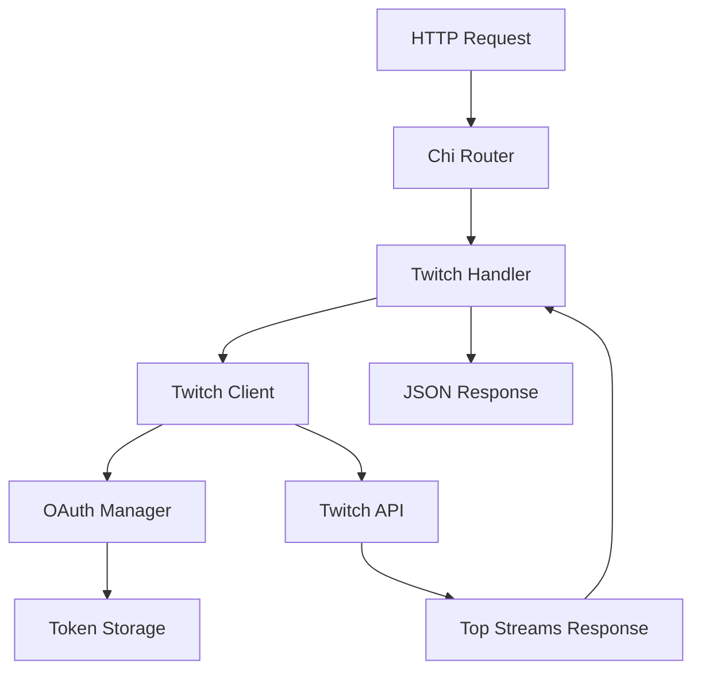

# Design Document

## Overview

The Twitch client handler will be implemented as a new package (`pkg/twitch`) that provides a simple client for interacting with the Twitch API. The design follows the existing VibeGuide architecture patterns, using environment-based configuration and integrating with the existing Chi router setup.

The implementation will focus on:
- OAuth 2.0 Client Credentials flow for authentication
- A single method to fetch top streams from Twitch API
- A REST endpoint (`/v1/twitch/streams/top`) to expose this functionality
- Simple error handling and JSON response formatting

## Architecture



The architecture consists of three main components:
1. **Twitch Client** - Core client that manages API interactions
2. **OAuth Manager** - Handles token acquisition and storage
3. **HTTP Handler** - Exposes functionality via REST endpoint

## Components and Interfaces

### Twitch Client (`pkg/twitch/client.go`)

```go
type Client struct {
    clientID     string
    clientSecret string
    oauthManager *OAuthManager
    httpClient   *http.Client
}

type StreamsResponse struct {
    Data []Stream `json:"data"`
}

type Stream struct {
    ID           string `json:"id"`
    UserID       string `json:"user_id"`
    UserLogin    string `json:"user_login"`
    UserName     string `json:"user_name"`
    GameID       string `json:"game_id"`
    GameName     string `json:"game_name"`
    Type         string `json:"type"`
    Title        string `json:"title"`
    ViewerCount  int    `json:"viewer_count"`
    StartedAt    string `json:"started_at"`
    Language     string `json:"language"`
    ThumbnailURL string `json:"thumbnail_url"`
}

func NewClient(clientID, clientSecret string) *Client
func (c *Client) GetTopStreams(ctx context.Context, limit int) (*StreamsResponse, error)
```

### OAuth Manager (`pkg/twitch/oauth.go`)

```go
type OAuthManager struct {
    clientID     string
    clientSecret string
    token        *Token
    httpClient   *http.Client
}

type Token struct {
    AccessToken string `json:"access_token"`
    TokenType   string `json:"token_type"`
    ExpiresIn   int    `json:"expires_in"`
}

func NewOAuthManager(clientID, clientSecret string) *OAuthManager
func (o *OAuthManager) GetToken(ctx context.Context) (string, error)
func (o *OAuthManager) refreshToken(ctx context.Context) error
```

### Configuration Extension

The existing `VibeConfig` struct will be extended to include Twitch credentials:

```go
type VibeConfig struct {
    // Existing fields
    Port   string
    LogLvl string
    
    // New Twitch fields
    TwitchClientID     string
    TwitchClientSecret string
}
```

### HTTP Handler (`cmd/vibeguide/twitch_handlers.go`)

```go
func twitchRouter(twitchClient *twitch.Client) http.Handler
func getTopStreamsHandler(twitchClient *twitch.Client) http.HandlerFunc
```

## Data Models

### Stream Data Model
The Stream struct represents a Twitch stream with essential information:
- Stream identification (ID, user info)
- Content metadata (game, title, language)
- Viewer metrics (viewer count)
- Timestamps and thumbnails

### API Response Format
Following the existing VibeGuide pattern using `mytypes.APIHandlerResp`:

```go
type TopStreamsResponse struct {
    TransactionId string           `json:"transaction_id"`
    ApiVersion    string           `json:"api_version"`
    Data          *StreamsResponse `json:"data"`
}
```

## Error Handling

### OAuth Errors
- Invalid credentials: Return configuration error during startup
- Token acquisition failure: Log error and return HTTP 503 Service Unavailable
- Token refresh failure: Attempt retry once, then return error

### API Errors
- Twitch API unavailable: Return HTTP 503 Service Unavailable
- Rate limiting: Return HTTP 429 Too Many Requests (though not implementing rate limiting initially)
- Invalid response: Return HTTP 502 Bad Gateway

### HTTP Handler Errors
- Use existing `handleErr` function pattern for consistent error responses
- Include transaction ID and API version in all error responses
- Log errors with appropriate context using zerolog

## Testing Strategy

### Unit Tests
- OAuth token acquisition and validation
- Stream data parsing and validation
- Error handling scenarios

### Integration Tests
- End-to-end API endpoint testing
- Twitch API integration (using test credentials)
- Configuration loading and validation

### Test Structure
```
pkg/twitch/
├── client_test.go
├── oauth_test.go
└── testdata/
    └── sample_streams_response.json
```

## Implementation Notes

### Environment Variables
Required environment variables:
- `TWITCH_CLIENT_ID`: Twitch application client ID
- `TWITCH_CLIENT_SECRET`: Twitch application client secret

### API Endpoints
- Base URL: `https://api.twitch.tv/helix`
- OAuth URL: `https://id.twitch.tv/oauth2/token`
- Top Streams: `/streams?first={limit}`

### Default Behavior
- Default limit for top streams: 100
- Maximum limit: 1000
- HTTP client timeout: 10 seconds
- Token stored in memory only (no persistence)

### Integration Points
- Extends existing Chi router in `main.go`
- Uses existing logging patterns with zerolog
- Follows existing configuration loading pattern
- Uses existing error handling utilities